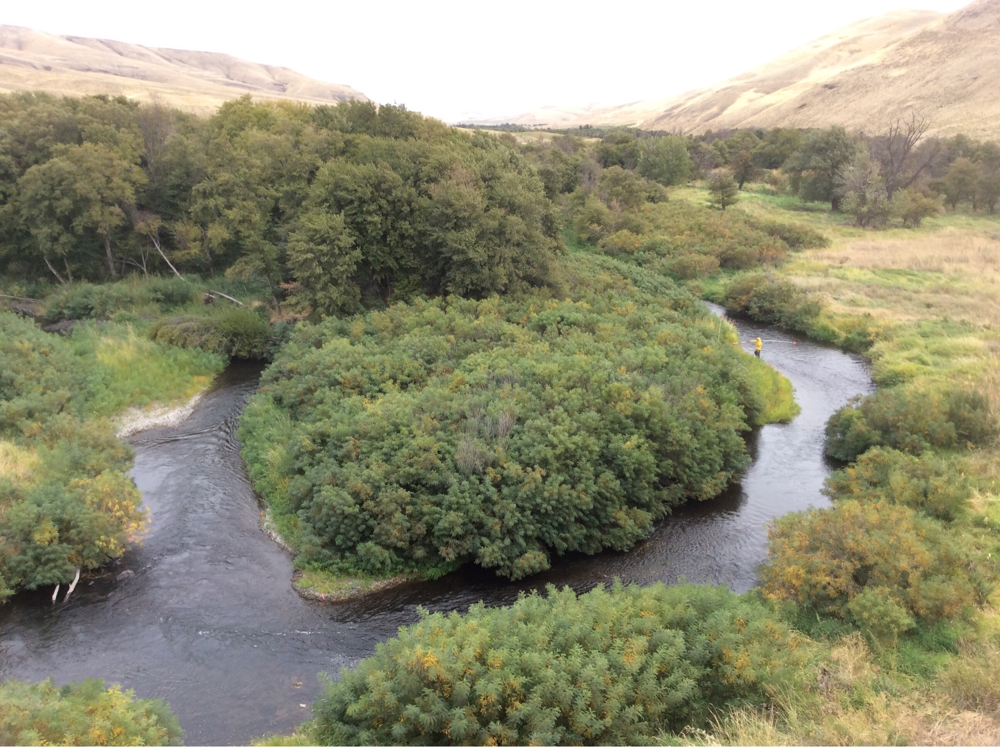
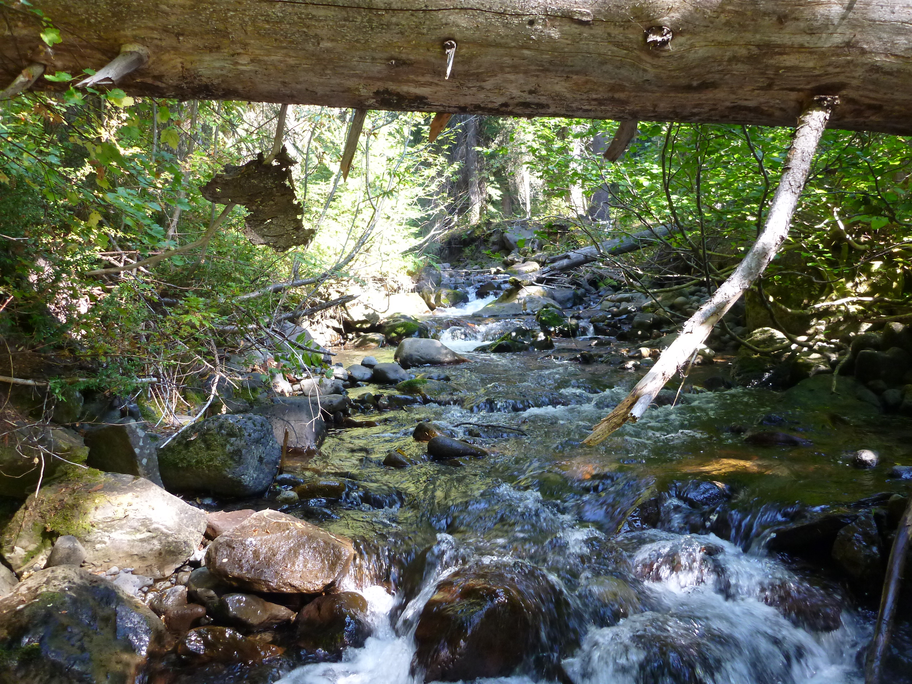

<!-- This is the format for text comments that will be ignored during renderings. Do not put R code in these comments because it will not be ignored. -->

```{r setup, echo = FALSE}
knitr::opts_chunk$set(
  collapse = TRUE,
  warning = FALSE,
  message = FALSE,
  echo = FALSE,
  comment = "#>",
  fig.path = "../figures/",
  dpi = 600
)
```

```{r packages}
library(survey)
library(tidyverse)
# library(QRFcapacity) # for the moment, until we know exactly what data to copy over to this repo
library(QRFpaper)
library(janitor)
library(knitr)
library(pander)
library(magrittr)
library(sf)
library(english)

theme_set(theme_bw())

panderOptions("big.mark", ',')

options(knitr.kable.NA = '-')
options(knitr.table.format = "pandoc")

# run this if running chunks directly
# setwd('analysis/paper')
```

```{r package-bibtex, eval = F}
knitr::write_bib(c("FSA", 
                   "Rcapture", 
                   "minerva", 
                   "quantregForest", 
                   "missForest",
                   "survey",
                   "sf", 
                   "knitr", 
                   "rmarkdown"),
                 file = 'packages.bib')
```

```{r load-data}
hab_data = read_rds("../data/derived_data/hab_data.rds")
fish_hab = read_rds("../data/derived_data/fish_hab.rds")
hab_dict = read_rds("../data/derived_data/hab_dict.rds")
qrf_data = read_rds("../data/derived_data/qrf_data.rds")
dens_offset = read_rds("../data/derived_data/dens_offset.rds")
qrf_mod = read_rds("../data/derived_data/qrf_mod.rds")
sel_hab_mets = read_rds("../data/derived_data/sel_hab_mets.rds")
gaa_covars = read_rds("../data/derived_data/gaa_covars.rds")
mod_data_weights = read_rds("../data/derived_data/mod_data_weights.rds")
all_preds = read_rds("../data/derived_data/all_preds.rds")
spawn_rec_params = read_rds("../data/derived_data/spawn_rec_params.rds")
model_svy_df = read_rds("../data/derived_data/model_svy_df.rds")
champ_wtsds = read_rds("../data/derived_data/champ_wtds.rds")

sel_hab_mets %<>%
  left_join(hab_dict %>%
              select(Metric = ShortName,
                     Name) %>%
              distinct()) %>%
  mutate(Name = recode(Name,
                       'Wetted Width To Depth Ratio Avg' = 'Width:Depth Ratio',
                       'Wetted Depth SD' = 'Depth Complexity',
                       'Wetted Channel Braidedness' = 'Braidedness',
                       'Fish Cover: Total' = 'Fish Cover',
                       'Riparian Cover: Some Canopy' = 'Riparian Canopy',
                       'Wetted Width Integrated' = 'Wetted Width',
                       'Substrate < 6mm' = 'Fines',
                       # 'Substrate: D16',
                       'Avg. August Temperature' = 'Avg. August Temp.',
                       'Large Wood Volume: Wetted Slow Water' = 'Large Wood Freq. in Pools'))
                       
```

```{r sp-rec-comp}
# rename one population
spawn_rec_params %<>%
  mutate(Population = recode(Population,
                             'Chiwawa R.' = 'Chiwawa River'))

# pull out estimates of capacity
cap_tbl = spawn_rec_params %>%
  select(Population, form, est, se, cv) %>%
  arrange(Population, form)

# make a few estimates NA (too big)
cap_tbl %<>%
  mutate_at(vars(est, se, cv),
            list(~ if_else(Population %in% c('Entiat River',
                                             'Marsh Creek',
                                             'Minam River',
                                             'Tucannon River') &
                             form == 'BevertonHolt',
                           as.numeric(NA), .)))


# pull out fitted spawner recruit curves
curve_fits = spawn_rec_params %>%
  select(Population, form, preds) %>%
  unnest(cols = "preds") %>%
  arrange(Population, form)

# define polygons for uncertainty shading
plot_max = Inf
plot_max = 5e5
cap_poly = cap_tbl %>%
  mutate(lwrCI = est + se * qnorm(0.025),
         uprCI = est + se * qnorm(0.975)) %>%
  mutate(lwrCI = if_else(lwrCI < 0, 0, lwrCI),
         uprCI = if_else(uprCI > plot_max, plot_max, uprCI)) %>%
  left_join(spawn_rec_params %>%
              select(Population, data) %>%
              unnest(cols = "data") %>%
              group_by(Population) %>%
              summarise_at(vars(Spawners, Parr),
                           list(min = min,
                                max = max),
                           na.rm = T)) %>%
  # select(Population, form, ends_with('min'), ends_with('max'), ends_with('CI'))
  group_by(Population, form) %>%
  summarise(coords = list(tibble(x = c(0, 0, Spawners_max, Spawners_max),
                                 y = c(lwrCI, uprCI, uprCI, lwrCI)))) %>%
  ungroup() %>%
  unnest(cols = c(coords))

# which watersheds to plot?
# keep_wtsds = spawn_rec_params %>%
#   filter(form == 'QRF',
#          !is.na(est)) %>%
#   filter(!Population %in% c('Methow R.')) %>%
#   pull(Population)

keep_wtsds = c('Catherine Creek',
               'Chiwawa River',
               'Upper Grande Ronde River',
               'Hayden Creek',
               'Minam River',
               'Tucannon River',
               'Upper Lemhi',
               'Lostine River',
               'South Fork Salmon River')

spawn_rec_comp_p = spawn_rec_params %>%
  # filter out a couple populations with super poor fits
  filter(Population %in% keep_wtsds) %>%
  select(Population, data) %>%
  unnest(cols = "data") %>%
  distinct() %>%
  ggplot(aes(x = Spawners,
             y = Parr)) +
  # geom_polygon(data = cap_poly %>%
  #                # filter out a couple populations with super poor fits
  #                filter(Population %in% keep_wtsds),
  #             aes(x = x,
  #                 y = y,
  #                 fill = form),
  #             alpha = 0.2) +
  geom_line(data = curve_fits %>%
              # filter out a couple populations with super poor fits
              filter(Population %in% keep_wtsds),
            aes(color = form),
            lwd = 1.5) +
  geom_hline(data = cap_tbl %>%
               # filter out a couple populations with super poor fits
               filter(Population %in% keep_wtsds),
             aes(yintercept = est,
                 color = form),
             linetype = 2) +
  geom_point(size = 3) +
  facet_wrap(~ Population,
             scales = 'free') +
  scale_color_brewer(palette = 'Set1',
                     breaks = c('QRF',
                                'BevertonHolt',
                                'Ricker',
                                'Hockey'),
                     labels = c('QRF', 
                                'Beverton Holt',
                                'Ricker',
                                'Hockey Stick'),
                     name = 'Model') +
  scale_fill_brewer(palette = 'Set1',
                    breaks = c('QRF',
                               'BevertonHolt',
                               'Ricker',
                               'Hockey'),
                    labels = c('QRF', 
                               'Beverton Holt',
                               'Ricker',
                               'Hockey Stick'),
                    name = 'Model') +
  labs(shape = 'Spawner\nType') +
  theme(legend.position = 'bottom')

# # to save a different version
# ggsave('../figures/sr-test.svg',
#        spawn_rec_comp_p,
#        width = 8,
#        height = 6)

```

# Introduction

The decline of anadromous Pacific salmonids (*Oncorhynchus spp.*) across the Pacific Northwest, USA has prompted numerous actions aimed at reversing that trend. These actions are often categorized into four H’s – harvest modification, hatchery practices, hydro-system operations, and habitat rehabilitation. Problematically, there is substantial uncertainty regarding the degree of change that can be exerted across and within these categories, and what combination of changes will most cost-effectively and sustainably reduce mortality. Recently released “de-listing” criteria [@NOAA2016; @NOAA2016b] identified adult escapement targets at the population scale, providing a quantitative metric useful for evaluating the magnitude of survival improvements required. These abundance targets provide a benchmark against which habitat rehabilitation actions can be measured. Here we describe an approach for estimating life-stage specific habitat-based carrying capacity that can be used to quantitatively identify the magnitude of tributary habitat rehabilitation necessary to support de-listing. For perhaps the first time, the necessity of tributary habitat restoration can be demonstrated and the magnitude of required change can be placed in context with the other “H’s.”

<!-- Need to define carrying capacity? -->

Pacific salmon (*Oncorhynchus spp.*) species have experienced large declines in abundance throughout much of their range [@Good2005]. Declines can be partially attributed to lost or altered habitat, and thus, efforts to recover depleted salmon populations are replete with efforts to rehabilitate habitat used during the freshwater life-stages. Specifically, restoring salmonid carrying capacity through tributary rehabilitation actions has been identified as a key component of recovery efforts for salmon and steelhead (*Oncorhynchus mykiss*) in the Pacific Northwest, USA. Efforts have included increasing and improving existing habitat for both spawning adults and rearing juveniles. However, estimating habitat carrying capacity, both historic and contemporary, for various life-stages of Pacific salmon, as well as identifying important habitat characteristics that influence capacity, has been an ongoing but necessary challenge. Reliable methods to better understand fish-habitat relationships as well as to estimate capacity are necessary to identify those salmon and steelhead life-stages that are limited by habitat capacity, and further, to better direct tributary rehabilitation efforts.

@Fausch1988 conducted a thorough review of attempts to predict the standing crop of fish from measurable habitat covariates from 1950 to 1985, and found that the vast majority of multiple linear regression models failed to detect a significant fish-habitat signal. Since that review, there has been progress in identifying some fish-habitat relationships for some salmonid species. @Nickelson1992 found that juvenile coho were found in higher densities within pool habitat on the Oregon coast. Similarly, pool and pond densities were good predictors of coho smolt densities in western Washington [@Sharma2001]. @Bryant2009 found that juvenile coho abundance was positively related to large wood at the reach scale, however their results demonstrated a negative relationship between abundance and the number of pools. @Braun2011 similarly found positive associations between spawner densities of sockeye in the Fraser River and large wood, in addition to positive relationships to percent undercuts and percent pools. Densities of adult spawning coho were also higher in forested areas compared to urban or agricultural areas in the Snohomish River watershed [@Pess2002]. @Mossop2006 examined juvenile Chinook in the Yukon river and found positive correlations between the log of fish density and several metrics related to residual pool dimensions and large woody debris abundance as well as a negative correlation between fish density and gradient. These studies were focused on predicting observed fish densities, not necessarily capacity, and for most of them the predictive extent is limited to a particular watershed. In addition, they all assumed some form of linear fish-habitat relationship, which often results in weak predictive power. 

A number of studies have utilized other modeling approaches to elicit non-salmonid fish habitat relationships. @Dunham2002 used a quantile regression approach to show a negative relationship between cutthroat trout densities and the width:depth ratio of a stream for the upper quantiles of trout density. The same approach was also used to map the potential extent of sole in the English Channel and southern North Sea [@Eastwood2003]. Machine learning models such as boosted regression trees and random forests have been used to examine species biomass, diversity and distribution for a number of different species [@Pittman2009; @Knudby2010; and @Compton2012]. @Wall2016 took a bioenergic approach to predict the capacity of a reach to support juvenile steelhead. The results from these studies highlight the importance and effectiveness of using techniques that can accommodate non-linear fish habitat relationships. 

Most studies that have investigated fish habitat relationships focus on predicting a species’ distribution (presence / absence) or the average abundance or density, neither of which can be easily manipulated to predict carrying capacity. Further, many of these studies focus on only one or two measures of habitat. @Sweka2010 estimated carrying capacity of Atlantic salmon parr using a quantile regression approach, but the only habitat covariate they included was cumulative drainage area. Traditionally, carrying capacity for salmonids has been estimated through stock-recruitment curves. However, this requires a long time-series of data with variety in the number of spawners which is not usually available [@Cramer2009].

<!-- and it often fails to account for habitat covariates. This manuscript incorporates multiple measures of stream habitat to estimate fish-habitat relationships that encompass the collinear nature of most stream habitat metrics and can be used to predict carrying capacity. Our approach moves across several spatial scales, inferring fish-habitat relationships from detailed, localized habitat data and extrapolating capacity predictions across wide swaths of unsampled locations. -->

In fisheries it has long been recognized that that biotic and abiotic factors limit productivity within and across life-stages. For the purposes of this paper, we define carrying capacity as the maximum number of individuals that can be supported given the quantity and quality of habitat available at a given life-stage. We assume that higher observed relative densities within a given life stage are a function of habitat quantity and quality. Furthermore, we assert that observed fish density is a poor predictor of habitat capacity owing to both a paucity of individuals, especially for threatened or endangered species, and the existence of unmeasured variables that may serve to limit capacity. To address this, we have developed a model to estimate juvenile rearing capacity for Pacific salmon in wadeable streams based on quantile regression forest (QRF) [@Meinshausen2006] models using measurements of fish abundance (and density) and habitat characteristics. QRF models combine the theory and justification of quantile regression modeling [@Koenker1978; @Cade2003] with the flexibility and framework of random forest models [@Breiman2001]. They account for unmeasured variables and can be used to describe the entire distribution of predicted fish densities for a given set of habitat conditions, not just the mean expected density. Random forest models have been shown to outperform more standard parametric models in predicting fish-habitat relationships in other contexts [@Knudby2010]. Quantile regression forests share many of the benefits of random forest models, such as the ability to capture non-linear relationships between independent and dependent variables, naturally incorporate interactions between covariates, and work with untransformed data while being robust to outliers [@Prasad2006]. Meanwhile, quantile regression models have been used in a variety of ecological systems to estimate the effect of limiting factors [@Terrell1996; @Cade2003].	 

The fish abundance/density and habitat data used to fit the QRF model presented here were available from seven watersheds within the interior Columbia River Basin (CRB), Pacific Northwest, USA. Within the interior CRB two major runs of Chinook salmon (*Oncorhynchus tshawytscha*; hereafter Chinook salmon) occur, stream-type (i.e., spring/summer run) and ocean-type (i.e., fall run), each characterized by different life history characteristics. Stream-type Chinook salmon enter freshwater earlier in the year, spawn in the upper reaches of a watershed, and the juveniles rear for up to 16 months in the freshwater before entering the ocean as smolts. Ocean-type Chinook salmon enter freshwater later (e.g. fall or winter) spawn lower in the watershed, and the juveniles may only spend between several weeks and six months in freshwater before migrating to the ocean. Here we focus on juvenile stream-type Chinook, in particular the summer rearing period during low flow. Data presented here are from Chinook salmon populations in the Upper Columbia River spring-run and Snake River spring/summer-run Evolutionary Significant Units (ESU). The Upper Columbia Spring-run ESU is listed as endangered under the Endangered Species Act, the Snake River Spring/Summer-run is listed as threatened [@NOAA2016; @NOAA2016b].  

In this study, we developed a QRF model to 

1. Identify measured habitat characteristics that are most strongly associated with observed Chinook salmon parr abundance and density,
1. Use paired fish and habitat measurements to elicit fish-habitat relationships for those habitat characteristics identified as important for determining fish abundance and density,
1. Predict contemporary habitat carrying capacity at all sites where the important habitat characteristics are measures (i.e., CHaMP sites within the Columbia River Basin),
1. Extrapolate capacity predictions at CHaMP sites across a watershed using globally available attribute data to estimate the Chinook salmon parr capacity of that watershed, and
1. Validate estimates of carrying capacity from QRF across multiple watersheds using independent estimates of capacity (e.g., spawner-recruit relationships).

This manuscript incorporates multiple measures of stream habitat to estimate fish-habitat relationships that encompass the collinear nature of most stream habitat metrics and can be used to predict carrying capacity. Our approach moves across several spatial scales, inferring fish-habitat relationships from detailed, localized habitat data and extrapolating capacity predictions across wide swaths of unsampled locations.

# Methods

## Study Site

Fish and habitat data used in our study were collected from eleven watersheds within the interior Columbia River Basin (CRB), Pacific Northwest, USA (Figure \@ref(fig:wtsd-map)). The CRB covers more than 668,000 km$^2$ draining large portions of Idaho, Oregon, and Washington, and smaller portions of Montana, Nevada, Utah, and Wyoming, as well as the southeastern portion of British Columbia. The habitat data used to populate the QRF model were collected by the Columbia Habitat Monitoring Program (CHaMP) [@Volk2017] and were downloaded from https://www.champmonitoring.org. Data from the following `r as.character(english(n_distinct(hab_data$Watershed)))` CHaMP watersheds were used in this study: `r paste(sort(unique(hab_data$Watershed))[-length(unique(hab_data$Watershed))], collapse = ', ')` and `r sort(unique(hab_data$Watershed))[length(unique(hab_data$Watershed))]`. Juvenile density and abundance data were collected in a subset of `r as.character(english(n_distinct(fish_hab$Watershed)))` watersheds, at CHaMP survey reaches and were graciously provided by a number of projects, including the Integrated Status and Effectiveness Monitoring Project [@Volk2017].

## Data

CHaMP sites are 200 m to 500 m reaches within wadeable streams across select basins within the interior Columbia River Basin (CRB) selected based on a spatially balanced Generalized Random Tesselation Stratified (GRTS) sample selection algorithm [@Stevens1999; @Stevens2004]. Habitat data within CHaMP sites were collected using the CHaMP protocol [@CHaMP2016] which calls for field data collection during the low-flow period, typically from June through October. CHaMP habitat data include, but are not limited to, measurements describing channel complexity, channel units, disturbance, fish cover, large woody debris, riparian cover, size (depth, width, discharge), substrate, temperature, and water quality. 

Juvenile fish surveys were conducted for sp/sum Chinook salmon parr during the summer low-flow season at many of the same sites surveyed using the CHaMP protocol. Survey methods included mark-recapture, three-pass removal sampling, two-pass removal sampling, and single-pass electrofishing, as well as snorkeling. These data were used to estimate sp/sum Chinook salmon parr abundance at all CHaMP sites where fish survey data were available. Three-pass removal estimates used the Carle-Strub estimator [@Carle1978], following advice from @Hedger2013. Two-pass removal estimates used the estimator described by @Seber2002. Mark-recapture estimates used Chapman’s modified Lincoln-Peterson estimator [@Chapman1951] and were deemed valid if they met the criteria described in @Robson1964. These estimates were made using the *removal* function from the *FSA* package [@R-FSA] or the *closedp.bc* function from the *Rcapture* package [@R-Rcapture] in R software [@Rsoftware2019]. Snorkel counts were transformed to abundance estimates using paired snorkel-electrofishing sites to calibrate snorkel counts. For sites with invalid estimates or that were sampled with a single electrofishing pass, we developed an estimate of capture probability based on valid estimates, using a binomial generalized linear mixed effects model. Fixed effects were species, wetted width of the site, density of fish caught on the first pass and all possible two-way interactions. We included a random effect for fish crew / watershed. We used this model to predict abundances based on the number of fish caught on the first pass and any other covariates.

Abundance estimates at all sites were then translated into linear (parr/m) fish densities which were paired with the associated CHaMP habitat data. For sites that were sampled in multiple years, only the fish and habitat data from the year with the highest observed fish density was retained to avoid possible pseudo-replication, while remaining consistent with our goal of estimating carrying capacity. After removing duplicate samples, our initial dataset contained `r n_distinct(qrf_data$Site)` unique sites with paired fish-habitat data (Table \@ref(tab:fish-hab-sites)). 

## Habitat Covariate Selection

A key step in developing a QRF model to predict fish capacities was selecting the habitat covariates to include in the model. Random forest models naturally incorporate interactions between correlated covariates, which is essential since nearly all habitat variables are considered correlated to one degree or another, however, we aimed to avoid overly redundant variables (i.e., variables that measure similar aspects of the habitat). Further, including too many covariates can result in overfitting of the model (e.g., including as many covariates as data points).

To prevent overfitting, we pared down the more than 100 metrics generated by the CHaMP protocol describing the quantity and quality of fish habitat for each survey site. To assist in determining the habitat metrics to include in the QRF model, we used the Maximal Information-Based Nonparametric Exploration (MINE) class of statistics [@Reshef2011] to determine those habitat characteristics (covariates) most highly associated with observed parr densities. We calculated the maximal information coefficient (MIC), using the R package *minerva* [@R-minerva], to measure the strength of the linear or non-linear association between two variables [@Reshef2011]. The MIC value between each of the measured habitat characteristics and parr density was used to inform decisions on which habitat covariates to include in the QRF parr capacity model.

Habitat metrics were first grouped into broad categories that included channel unit, complexity, cover, disturbance, riparian, size, substrate, temperature, water quality, and woody debris. Habitat metrics measuring volume or area were scaled to the wetted area of each site. Within each category, metrics were ranked according to their MIC value (**Figure ??**). Our strategy was to select one or two variables with the highest MIC score within each category so that covariates describe different aspects of rearing habitat (e.g., substrate, temperature, etc.). Additionally, we attempted to avoid covariates that were highly correlated (**Figure ??**) while including covariates that can be directly influenced by restoration actions or have been shown to impact salmonid juvenile density. 

***Worth putting the whole MIC habitat selection approach in an appendix or supplemental material, so we can include large figures and tables?***

## QRF Model Fit

Using the selected habitat covariates (Table \@ref(tab:select-mets-table)), we fit a QRF model to predict habitat rearing capacity for spring/summer Chinook salmon parr, during summer months. After constructing a random forest, predictions of the mean response can be made by averaging the predictions of all trees, similar to the expected value predictions from a statistical regression model. However, the individual predictions from each tree, viewed collectively, describe the entire distribution of the predicted response, therefore, the random forest model can be used in the same way as other quantile regression methods to predict any quantile of the response. There were missing values for some habitat data; thus, any site visit with more than three missing covariates was removed from the dataset and the remaining missing habitat values were imputed using the *missForest* R package [@R-missForest; @Stekhoven2012]. We fit the QRF models using the *quantregForest* function from the *quantregForest* package [@R-quantregForest] in R software [@Rsoftware2019], incorporating data from `r nrow(qrf_data)` records (paired fish-habitat data) and `r as.character(english(nrow(sel_hab_mets)))` habitat covariates (`r round(nrow(qrf_data) / nrow(sel_hab_mets), 1)` data points per covariate) (Table \@ref(tab:select-mets-table)). The 90th quantile of the predicted distribution was used as a proxy for carrying capacity, following the suggestion of @Sweka2010, and to avoid higher quantiles that draw from the very upper tails of observed fish density, where the variability of predictions may be influenced by small sample size issues.

After model fitting, the QRF model was then be used to predict capacity using measurements of the habitat covariates that were used to fit the model. In our case, this includes all sites within CHaMP basins in the interior Columbia River basin. For CHaMP sites that have been sampled in multiple years, we first calculated the mean for each habitat metric among years to make predictions. In total, we generated `r filter(all_preds, is.na(chnk_per_m_se)) %>% summarise(n_sites = n_distinct(Site)) %>% pull(n_sites)` predictions of spring/summer Chinook salmon parr capacity, during summer months, for the following basins: Entiat, Grande Ronde (including Minam), John Day, Lemhi, Methow, South Fork Salmon, Tucannon, Wenatchee and Yankee Fork.

## Extrapolating to Other Sites

<!-- Using the QRF model, we predicted habitat capacity for juvenile rearing at all CHaMP sites within the interior Columbia River basin.  -->

To predict capacity at larger spatial scales, such as the watershed or population, we developed two extrapolation models (linear and areal capacity) based on globally available attributes (GAA) which were available for the entirety of tributary habitat utilized by a given population. The GAA data used here was taken from the list of GRTS master sample sites that the CHaMP sites were originally selected from [@Larsen2008; @Larsen2016]. Possible covariates included temperature range, growing degree days, an index of disturbance, the square root of cumulative drainage area, stream power, slope, channel type and watershed (Table \@ref(tab:gaa-covars)). The natural log of the CHaMP site capacity predictions was used as the response variable in a multiple linear regression model that incorporated the design weights of the CHaMP sites using the *svyglm* function from the *survey* package [@R-survey] in R software [@Rsoftware2019]. We fit two extrapolation models to each type of fish density, one that included watershed as covariate, for use in predicting capacity within CHaMP watersheds, and one that did not, for predicting everywhere else. We then made predictions of linear and areal capacity at all master sample sites throughout the interior CRB, generally spaced about one kilometer apart. Summaries of extrapolation model fit are shown in Table \@ref(tab:extrap-r2-table).

To summarize capacity at larger scales, the mean linear capacity (e.g., fish/m) of the master sample points along a particular tributary is multiplied by the length of that tributary. We first restricted the master sample points and lengths of streams to those with the domain of spring/summer Chinook, as defined by StreamNet ([http://www.streamnet.org](http://www.streamnet.org) ) or using expert opinion from local biologists. The capacities of various tributaries could then be summed to estimate capacity at almost any spatial scale. 

<!-- However, for visualization, predictions of areal capacity (fish/m$^2$) were used.  -->
<!-- The sentence above was dropped, unless we are going to include an example map of QRF capacity estimates -->

## Model Validation

Spawner-recruit data from several watersheds within the interior CRB were compiled to validate the extrapolated QRF estimates of spring/summer Chinook salmon parr capacity. Some watersheds had direct estimates of parr, while some had estimates of smolts and pre-smolts from rotary screw traps. For the latter, estimates of parr were calculated using estimates of over-winter survival. A series of spawner-recruit functions were then fit to this data including Beverton-Holt, Ricker, and hockey stick, using the *FSA* package [@R-FSA] in R. Estimates of capacity from each of these spawner-recruit curves were compared with QRF estimates of capacity for the same regions.

# Results

## Habitat Covariate Selection

We categorized `r filter(hab_dict, MetricGroupName == "Visit Metric") %>% nrow()` habitat measurements collected using the CHaMP habitat protocol [@CHaMP2016] into `r n_distinct(hab_dict$MetricCategory[!is.na(hab_dict$MetricCategory)]) %>% english %>% as.character` habitat categories, and for each habitat covariate an MIC value was calculated based on the strength of association between the habitat covariate and the response variable, parr density (fish/m). We chose the following `r as.character(english(nrow(sel_hab_mets)))` CHaMP habitat covariates to fit the QRF model: wetted width, observed discharge, average august temperature, wetted width:depth ratio, percent fines less than 6mm, total fish cover, channel unit frequency, standard deviation of the wetted depth, frequency of large wood in pools, percent riparian canopy cover, lower quantile of substrate size (D16) and braidedness (Table \@ref(tab:select-mets-table)). 

## QRF Model

A QRF model was fit using those metrics and the *quantregForest* package [@Meinshausen2006] in R [@Rsoftware2019] and the 90th quantile of the predicted distribution was used as a proxy for carrying capacity. After model fit, we examined the relative importance of each habitat covariate included in the model (Figure \@ref(fig:rel-imp-figure)). Moreover, QRF models allow one to visually examine the marginal effect of each habitat covariate on the quantile of interest using partial dependence plots (PDP). These plots show the marginal effect of changing a single habitat covariate while maintaining all other covariates at their mean values (Figure \@ref(fig:pdp-figure)). However, given that many habitat metrics are somewhat correlated, these marginal effects are often not independent of one another, so care should be taken when interpretting them. After model fitting, the QRF model was used to predict habitat capacity at all CHaMP sites within the interior Columbia River basin. 

## Extrapolating to Other Sites

We fit a linear regression extrapolation using QRF-based predictions of capacity at all CHaMP sites as the response, and various GAAs as the independent variables. The coefficients for the extrapolation model can be found in Table \@ref(tab:gaa-covars). From this, we have estimates of capacity at every master sample point in the CRB, which are located approximately one kilometer apart.

## Model Validation

Estimates of Chinook salmon parr capacity from the QRF and extrapolation models were comparable to independent estimates from spawner-recruit data (Table \@ref(tab:sr-table), Figure \@ref(fig:sr-figure)). QRF estimates had overlapping confidence intervals with one or more of the Beverton-Holt, Ricker, or hockey stick model estimates in each of the seven locations where comparisons were possible (Figure \@ref(fig:sr-figure)). Possible additional uncertainty was not accounted for in estimates of spawners-per-redd or spawners-per-parr, which would increase the confidence intervals around spawner-recruit estimates and the overlap among estimates. Correlations between parr capacity estimates from the QRF model and spawner-recruit models ranged from 0.905 (Beverton-Holt) to 0.965 (hockey stick). This favorable comparison provides strong validation, as the spawner-recruit estimates of Chinook salmon parr capacity were developed from completely independent datasets and using entirely different methods.

# Discussion

## A Tool To Estimate Habitat Capacity

In this study, we developed a novel approach to estimate the capacity of habitat to support Chinook salmon parr during summer months in wadeable streams. Our model can be used to quantify juvenile rearing capacity in Chinook salmon watersheds or populations and, in turn, quantify the magnitude of tributary habitat rehabilitation necessary to support Endangered Species Act (ESA) delisting. The QRF and extrapolation models presented here provide useful tools towards the prioritization, implementation, and evaluation of habitat restoration actions to recover depleted salmon populations. Moreover, the models presented here can be applied to multiple stages within the life cycle (e.g., parr, smolt, adult). Estimates of habitat carrying capacity for multiple life stages will allow biologists and managers to identify what life stage specific habitat is limiting. For example, QRF models and associated extrapolation models may demonstrate that habitat for a given population is sufficient to support adult spawning required for ESA delisting, but that juvenile capacity may not be sufficient to support those levels of adult spawning. In such a case, habitat restoration actions may be most cost-effectively and sustainably directed towards juvenile rearing habitat. Models to estimate habitat carrying capacity for multiple life stages will help to better direct habitat restoration actions.

## What Carrying Capacity Models Are Currently Available?

When it comes to estimating carrying capacity, spawner-recruit models are the gold standard [@Moussalli1986; @Myers1999]. However, such models require a long time-series of accurate estimates of adults and juveniles, with variation in the number of adults. Such datasets are not available everywhere, nor do they necessarily allow one to link capacity to habitat characteristics, except perhaps at the watershed scale. QRF models require a large number of paired fish-habitat sites, but if done across a wide variety of habitat types this data could theoretically be collected in a single season. Or the dataset could be built over time, sampling different locations in different years. If the latter approach is taken, some thought must be given to possible year effects and how to best deal with them. 

The favorable comparison between QRF estimates of watershed capacity and the spawner-recruit estimates in selected watersheds goes a long way to justifying this approach. Although built from completely different data, when these mulitple lines of evidence converge it lends credence to the QRF results. 

Historically, fish-habitat relationship models have focused on species distribution or average abundance/density rather than directly addressing carrying capacity. Bioenergics approaches, such as the net rate of energy intake (NREI) have been applied to salmonids to estimate capacity on the same reach scale that our QRF model operates on [@Wall2016]. However, there are some potential issues with how the food supply (i.e. invertebrate drift) is measured with these methods that could lead to biases in capacity estimates [@Dodrill2016]. The QRF approach described here allows us to analyze multiple (often correlated) habitat metrics and assess the potentially non-linear fish habitat relationships that define capacity as function of habitat.

## Biological Expectations from QRF Model

The results of the QRF parr capacity model for spring/summer Chinook salmon meet many biological expectations. Focusing on the partial dependence plots (Figure \@ref(fig:pdp-figure)), the QRF model predicts capacity to increase when the wetted width, discharge and the width-to-depth ratio grow, when temperatures are cooler, when there is less fine sediment, when there is more fish cover, when channel unit frequency increases and when the standard deviation of the wetted depth (a proxy for complexity) increases. These are all patterns that emerged from the fish-habitat data, and those fish-habitat relationships match what has been found qualitatively in many other studies (**need more citations??**) [@Mossop2006]. 

The biggest driver of capacity is stream size, whether measured by wetted width or discharge, which should be unsurprising since we are using fish per meter as our response. In many ways, these metrics define habitat quantity. However, other metrics help define habitat quality, such as cooler temperatures in August, less pool-tail fine sendiment, and higher channel unit frequencies (another way of saying more pool-riffle interfaces). 

<!-- Try to include images of high capacity / low capacity sites  -->
See Figures \@ref(fig:site-photo-high) and \@ref(fig:site-photo-low).

## Extrapolation Model

Fish are mobile creatures, and determining the appropriate spatial scale to estimate how their capacity may be determined by habitat characteristics is important. In the summer, for Chinook parr, there is clearly movement between multiple channel units (e.g. pool, riffle, run), suggesting that fish are utilizing habitat at a larger scale than the channel unit. However, it is unlikely that they are moving up and down the entire watershed. Therefore, we believe the 200 - 500 m reaches used in this study are an appropriate scale to capture the fish-habitat relationships that define carrying capacity. At the same time, we acknowledge that managers, life-cycle modelers and others are often interested in capacity estimates at larger spatial scales. While our QRF model can provide site-specific estimates of carrying capacity derived from paired fish-habitat data, our extrapolation model allows for estimates at larger spatial extents, such as watershed and population level scales. This is an efficient technique to leverage existing relationships for meaningful management decisions.

Our extrapolation model was focused on extrapolating to other master sample points, because that is the dataset available to us, but the methodology could be improved. Extrapolating to reaches on a stream network, as opposed to points on the landscape, could improve the interpretability of the results. This would require a stream network with relevant attributes attached to each reach, similar to the GAAs we used. Another approach could be to move towards sampling habitat in a more spatially continuous fashion, covering most or all of a watershed, and builting a QRF model from that dataset. Even if the fish data was not done continously, estimates of capacity could be made directly from the QRF model across the entire stream network, without the need for an extrapolation model.

<!-- Do we need any more in this section? I commented out the paragraph below... -->

<!-- While the Columbia River Basin is an excellent candidate for this type of extrapolation given the wealth of CHaMP data, application of this technique to areas with limited habitat data may be considerably more challenging. On-the-ground habitat data collection is costly, time-consuming, and often not reproducible; thereby limiting the effectiveness of this type of extrapolation.  Additionally, the extrapolation model relies on Global Available Attribute (GAA) data which ….  -->

<!-- Add here why GAA are messy. And then anything else which may be a consideration for using the extrapolation model moving forward.  -->

## The Future: Improving Habitat Data

<!-- Discussion of improving habitat data to possibly avoid extrapolation. Collect cheaper/better spatially continuous habitat data. -->

<!-- I have no idea if this is what you are looking for so feel free to delete if I am way off base.  -->

Given the cost/extent of data necessary for QRF extrapolation in watersheds outside of the CRB, there is a pressing need to develop new tools for habitat analyses.  Unmanned Aerial Systems (UAS or drone, commonly) are gaining popularity in wildlife and ecosystem monitoring for their ease of use, safety, accessibility, and cost-efficiency [@Jones2006; @Chabot2015]. UAS produce high-resolution, permanent data at a fraction of the cost of on-the-ground habitat sampling. Advances in imaging techniques (e.g., multispectral imaging) and post processing (e.g., automation of data collection from imagery) are already demonstrating increase in the efficiency and accuracy of data collection [@Whitehead2014; @LeCun2015; @Weinstein2018]. 

Development of a standardized protocol to incorporate remotely sensed data (LiDAR, aerial imagery) into the collection of habitat metrics would greatly improve the broadscale application of QRF. Rapid advances drone technology further improves upon traditional habitat data collection by leveraging 1) sub-meter global navigation satellite system (GNSS) receivers; 2) cost-effective drone imagery collection, image stitching, and photogrammetry; and 3) semi-automated data post-processing. All data collection efforts would be georeferenced and topologically compatible to increase repeatability of methods and data collection locations; a primary criticism of previous CHaMP survey efforts. The implementation of such a protocol would circumvent the need to extrapolate by collecting data for individual channel units in a rapid manner using remote sensing technologies, thereby reducing labor, providing a cost-effective tool for habitat data collection supporting status and trend evaluation and model products to better inform habitat restoration prioritization and planning.


## Conclusions and Next Steps

<!-- The beginning of the following paragraph may need some word-smithing -->

If a species' carrying capacity is defined or constrained, at least in part, by the habitat in which it lives, then illuminating statistically how such habitat impacts carrying capacity can lead to understanding how a species interacts with its environment. This understanding could be of crucial importance in the realm of conservation, when dealing with an endangered or threatened species, but species/habitat interactions are a core element of ecological studies more generally. We have demonstrated how a quantile regression approach, coupled with a random forest framework, can be used to estimate these relationships, and predict an habitat's capacity. As large ecological datasets become more accessible, and the ability to measure large swaths of habitat more feasible, we believe this approach has many potential applications, from the North American breeding bird survey to groundfish trawl surveys. ***other potential examples (coral reefs? turtles?)***

<!-- Consider pulling back and thinking about whether these kinds of techniques could be applied to other systems (terrestial, ocean, etc.). One example might the breeding bird survey, if someone could gather some habitat metrics at all the various sampling routes (big GIS exercise). If not, we may want to target a more fisheries-centric journal -->

# Acknowledgements

Model development efforts have been funded by the Bonneville Power Administration through projects 2003-017-00 and 2011-006-00 and by the Bureau of Reclamation and Idaho Office of Species Conservation through contract BOR002 16. Fish sampling work in the Lemhi River was also funded through the Idaho Office of Species Conservation through the Pacific Coast Salmon Recovery Fund. Special thanks to staff from the following agencies for providing data to calculate Chinook salmon parr abundance and density estimates: Columbia River Inter-Tribal Fish Commission, Oregon Department of Fish and Wildlife, and U.S. Fish and Wildlife Service. The models in this study were improved by conversations with Eric Buhle.

<!-- The following line inserts a page break  -->
\newpage

# References 
<!-- The following line ensures the references appear here for the MS Word or HTML output files, rather than right at the end of the document (this will not work for PDF files):  -->
<div id="refs"></div>

\newpage

# Tables

<div id="tables"></div>

```{r fish-hab-sites}
qrf_data %>%
  tabyl(Watershed) %>%
  adorn_totals() %>%
  adorn_pct_formatting() %>%
  rename(`n Sites` = n,
         Percent = percent) %>%
  # pander(caption = "(\\#tab:fh-samp-table)The number of unique sites, by watershed, with paired fish-habitat data used to populate the spring/summer Chinook salmon parr capacity QRF model.")
  kable(caption = 'The number of unique sites, by watershed, with paired fish-habitat data used to populate the spring/summer Chinook salmon parr capacity QRF model',
        booktabs = T)
  
```

```{r select-mets-table}
qrf_mod$importance %>%
  as_tibble(rownames = 'ShortName') %>%
  rename(imp = IncNodePurity) %>%
  arrange(desc(imp)) %>%
  mutate(Rank = 1:n()) %>%
  select(-imp) %>%
  left_join(hab_dict %>%
              select(-Name) %>%
              inner_join(sel_hab_mets %>%
                           rename(ShortName = Metric))) %>%
  filter(MetricGroupName != 'Tier 1 Summary') %>%
  select(Rank,
         Metric = Name,
         `Metric Category` = MetricCategory,
         Description = DescriptiveText) %>%
  # pander(caption = "(\\#tab:select-mets-table) Habitat metrics and descriptions of metrics included in the QRF model to predict spring/summer Chinook salmon parr capacity (during summer months). Metrics are ranked in order of relative importance.")
  kable(caption = "Habitat metrics and descriptions of metrics included in the QRF model to predict spring/summer Chinook salmon parr capacity (during summer months). Metrics are ranked in order of relative importance.",
        booktabs = T,
        format.args = list(width = c(2, 10, 10, 50)))
  
```

```{r gaa-covars}
gaa_meta = read_rds("../data/derived_data/gaa_metadata.rds")

tibble(Covariate = gaa_covars) %>%
  left_join(gaa_meta %>%
              select(Covariate = FieldName,
                     Name = DisplayName,
                     Units,
                     SpatialScale)) %>%
  mutate(Units = if_else(Units == "na",
                         as.character(NA),
                         Units),
         Units = if_else(grepl('\\^2', Units),
                         str_replace(Units, '\\^2', '$^2$'),
                         Units)) %>%
  left_join(model_svy_df$mod_full[[1]] %>%
              summary() %>%
              coefficients() %>%
              as_tibble(rownames = "Covariate") %>%
              select(1:3)) %>%
  # pander(caption = "(\\#tab:gaa-covars)Globally available attribute (GAA) habitat covariates used to extrapolate quantile regression forest (QRF) model predictions of spring/summer Chinook parr capacity to a larger scale (e.g., watershed, population), with their coefficients and standard errors.")
  kable(caption = "Globally available attribute (GAA) habitat covariates used to extrapolate quantile regression forest (QRF) model predictions of spring/summer Chinook parr capacity to a larger scale (e.g., watershed, population), with their coefficients and standard errors.",
        booktabs = T, 
        escape = F,
        digits = 3)

```

```{r extrap-r2-table}
model_svy_df %>%
  ungroup() %>%
  mutate(n_full = map_dbl(data,
                          .f = nrow),
         k_full = map_dbl(mod_full,
                          .f = function(x) {
                            names(x$coefficients)[!grepl('Intercept', names(x$coefficients))] %>%
                              length
                          }),
         r_full = map_dbl(mod_full,
                          .f = function(x) {
                            cor(x$y, x$fitted.values)
                          }),
         r2_full = r_full^2,
         r2_adj_full = 1 - ( ( (1 - r2_full) * (n_full - 1) ) / (n_full - k_full - 1) )) %>%
  mutate(n_no_champ = map_dbl(data,
                              .f = nrow),
         k_no_champ = map_dbl(mod_no_champ,
                              .f = function(x) {
                                names(x$coefficients)[!grepl('Intercept', names(x$coefficients))] %>%
                                  length
                              }),
         r_no_champ = map_dbl(mod_no_champ,
                              .f = function(x) {
                                cor(x$y, x$fitted.values)
                              }),
         r2_no_champ = r_no_champ^2,
         r2_adj_no_champ = 1 - ( ( (1 - r2_no_champ) * (n_no_champ - 1) ) / (n_no_champ - k_no_champ - 1) )) %>%
  select(response, starts_with("r2")) %>%
  gather(type, r2, -response) %>%
  mutate(model = if_else(grepl('no_champ', type),
                         'non-CHaMP',
                         'CHaMP'),
         type = if_else(grepl('adj', type),
                        'Adjusted R2',
                        'R2')) %>%
  spread(type, r2) %>%
  mutate(response = recode(response,
                           'chnk_per_m' = 'fish/m',
                           'chnk_per_m2' = 'fish/m$^2$')) %>%
  select(Model = model,
         Response = response,
         `$r^2$` = R2, 
         `Adjusted $r^2$` = `Adjusted R2`) %>%
  # pander(caption = "(\\#tab:extrap-r2-table)Summary of extrapolation model fits, split by each of the responses and whether the extrapolation model used CHaMP watershed as a covariate or not.")
  kable(caption = "Summary of extrapolation model fits, split by each of the responses and whether the extrapolation model used CHaMP watershed as a covariate or not.",
        escape = F,
        booktabs = T,
        digits = 3)
  
```


```{r sr-table}
spawn_rec_params %>%
  select(Population, data) %>%
  unnest(data) %>%
  group_by(Population) %>%
  summarise(`n Yrs` = n_distinct(BroodYear),
            Spawner_type = unique(Spawner_type)) %>%
  select(Population, `n Yrs`, Spawner_type) %>%
  mutate(Spawner_type = recode(Spawner_type,
                               'total spawners' = 'Spawners',
                               'redd counts' = 'Redds')) %>%
  rename(`Adult Data` = Spawner_type) %>%
  mutate(`Parr Data` = if_else(grepl('Chiwawa', Population),
                               'Parr Surveys',
                               'RST')) %>%
  full_join(spawn_rec_params %>%
              mutate(prnt_val = paste0(prettyNum(round(est), big.mark = ','), ' (', round(cv, 3), ')')) %>%
              select(Population, form, prnt_val) %>%
              mutate(form = recode(form,
                                   'BevertonHolt' = 'Beverton Holt',
                                   'Hockey' = 'Hockey Stick')) %>%
              mutate(form = factor(form,
                                   levels = c('Beverton Holt',
                                              'Ricker',
                                              'Hockey Stick',
                                              'QRF'))) %>%
              spread(form, prnt_val)) %>%
  filter(Population %in% keep_wtsds) %>%
  mutate(Population = recode(Population,
                             'Chiwawa R.' = 'Chiwawa River')) %>%
  # pander(caption = "(\\#tab:sr-table)Estimates of parr capacity from both spawner-recruit data (Beverton-Holt, Ricker, hockey stick) and from extrapolated estimates of parr capacity from the quantile regression forest (QRF) model. Numbers in parentheses are coefficients of variation.")
  kable(caption = "Estimates of parr capacity from both spawner-recruit data (Beverton-Holt, Ricker, hockey stick) and from extrapolated estimates of parr capacity from the quantile regression forest (QRF) model. Numbers in parentheses are coefficients of variation.",
        booktabs = T)

```

\newpage

# Figures

<div id="figures"></div>

```{r wtsd-map, fig.cap = "Watersheds with CHaMP habitat data. Watersheds in black also contain paired fish data. Watershed names are: 1 - Entiat, 2 - John Day, 3 - Lemhi, 4 - Methow, 5 - Minam, 6 - Secesh, 7 - South Fork Salmon, 8 - Tucannon, 9 - Upper Grande Ronde, 10 - Wenatchee, 11 - Yankee Fork."}
# knitr::include_graphics('../figures/ChampWtds.png')
knitr::include_graphics('../figures/ChampWtds.jpeg')
```

```{r rel-imp-figure, fig.cap = "Relative importance of each habitat covariate included in the quantile regression forest (QRF) model to predict habitat capacity, during summer months, for spring/summer Chinook salmon parr"}
qrf_mod$importance %>%
  as_tibble(rownames = 'ShortName') %>%
  rename(imp = IncNodePurity) %>%
  mutate(imp = (imp / max(imp)) * 100) %>%
  arrange(desc(imp)) %>%
  left_join(hab_dict %>%
              filter(is.na(MetricGroupName) | MetricGroupName != 'Tier 1 Summary')) %>%
  select(-Name) %>%
  left_join(sel_hab_mets %>%
              select(ShortName = Metric,
                     Name)) %>%
  mutate_at(vars(ShortName, Name, MetricCategory),
            list(~ fct_reorder(., .x = imp))) %>%
  ggplot(aes(x = Name,
             y = imp)) +
  # geom_col(aes(fill = MetricCategory)) +
  # scale_fill_brewer(palette = 'Set2') +
  geom_col(fill = 'gray40') +
  coord_flip() +
  labs(x = 'Metric',
       y = 'Relative Importance')
  
 ```

```{r pdp-figure, fig.cap = "Partial dependence plots for the spring/summer Chinook salmon parr capacity quantile regression forest (QRF) model, depicting how parr capacity shifts as each habitat metric changes, assuming all other habitat metrics remain at their mean values. Tick marks along the X-axis depict observed values."}
plot_partial_dependence(rf_mod = qrf_mod,
                        data = qrf_data,
                        data_dict = hab_dict %>%
                          select(-Name) %>%
                          inner_join(sel_hab_mets %>%
                                       select(ShortName = Metric,
                                              Name)),
                        type = 'quantile',
                        pred_quantile = 0.9,
                        log_transform = T,
                        log_offset = dens_offset,
                        scales = 'free') +
  labs(y = 'Capacity Prediction (per m)') +
  scale_color_grey(start = 0.5, end = 0.5) +
  theme(legend.position = 'none',
        strip.text = element_text(size = 6))
```

```{r sr-figure, fig.cap = "Spawner-recruit data from nine watersheds. Solid lines are the spawner-recruit curve, dashed lines are the estimated capacity, and shaded polygons depict the 95% confidence intervals of capacity. Red corresponds to Beverton-Holt models, purple to Ricker models, blue to hockey stick models, and green to QRF estimates. The QRF solid curve is a Beverton-Holt model with the capacity parameter fixed to the QRF estimate of capacity."}

spawn_rec_comp_p +
  theme(strip.text = element_text(size = 7))
```

```{r site-photo-high, dpi = 300, fig.cap = 'Photo of CHaMP site, CBW05583-415923, with predicted high capacity.'}

```

```{r site-photo-low, dpi = 300, fig.cap = 'Photo of CHaMP site, CBW05583-109994, with predicted low capacity.'}

```


<!-- The following line inserts a page break  -->
\newpage

### Colophon

This report was generated on `r Sys.time()` using the following computational environment and dependencies: 

```{r colophon, cache = FALSE}
# which R packages and versions?
if ("devtools" %in% installed.packages()) devtools::session_info()
```

The current Git commit details are:

```{r}
# what commit is this file at? 
if ("git2r" %in% installed.packages() & git2r::in_repository(path = ".")) git2r::repository(here::here())  
```
